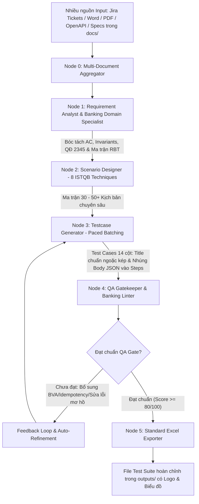

# 🏦 QA Agentic Workflow (Banking & Finance ISTQB & RBT Enabled)

Hệ thống **Multi-Agent AI Workflow** tự động hóa toàn bộ quy trình kiểm thử từ **Phân tích Yêu cầu (Requirements Analysis)**, **Đánh giá Rủi ro (RBT)**, **Thiết kế Ma trận Kịch bản (8 Kỹ thuật ISTQB)** đến **Sinh Test Case 14 Cột Chuẩn Ngân Hàng** xuất ra file Excel hoàn chỉnh có Logo, Biểu đồ tiến độ và Công thức tự động.

---

## 🌟 8 Kỹ Thuật Thiết Kế Kiểm Thử Chuẩn Quốc Tế (ISTQB Multi-Technique)

Hệ thống áp dụng đồng thời **8 kỹ thuật kiểm thử chuyên sâu** nhằm đạt số lượng từ **30 đến 50+ Test Cases chi tiết** cho mỗi tính năng, đảm bảo độ bao phủ (coverage) toàn diện:

| # | Kỹ Thuật Kiểm Thử | Trọng Tâm & Quy Chuẩn Áp Dụng | Kịch Bản Tiêu Biểu |
| :- | :--- | :--- | :--- |
| **1** | **Phân vùng Tương đương (EP)** | • Từng giá trị hợp lệ/không hợp lệ của Enum.<br>• Kiểm tra thiếu từng trường bắt buộc (*Field-by-field*).<br>• Sai kiểu dữ liệu (*String vào Boolean/Int/Float, Object vào Array*). | Kiểm tra khai báo Global Params của phí không thành công khi truyền thiếu trường bắt buộc `"tiering_method"` |
| **2** | **Phân tích Giá trị Biên (BVA 2 & 3-Value)** | • Biên hạn mức: `Min-1`, `Min`, `Min+1`, `Max-1`, `Max`, `Max+1`, số âm, số 0.<br>• Biên dải bậc thang (*Bands*): `min > max`, chồng lấn (*overlapping*), hở dải, dải cuối `max != null`. | Kiểm tra chuyển tiền Napas 24/7 thành công khi truyền `"amount"` vừa chạm hạn mức tối đa `"499,999,999"` VND |
| **3** | **Bảng Quyết định (Decision Table - DTT)** | • Ma trận điều kiện kết hợp đa chiều: *Phân loại KH x Loại tài khoản (CASA/Tiết kiệm) x Kênh giao dịch x Khung giờ*. | Kiểm tra tính phí dịch vụ đối với khách hàng VIP giao dịch ngoài giờ trên kênh Mobile |
| **4** | **Kiểm thử Chuyển đổi Trạng thái (STT)** | • Vòng đời thực thể (*Draft -> Active -> Suspended -> Closed*).<br>• Ngăn chặn sửa tham số hoặc giao dịch khi tài khoản đang `LOCKED` / `FROZEN`. | Kiểm tra hệ thống từ chối giao dịch rút tiền khi tài khoản đang ở trạng thái `"LOCKED"` |
| **5** | **Đua tranh & Trùng lặp (Idempotency & Concurrency)** | • Gửi 2 request trùng `idempotency_key` liên tiếp -> Chống trừ tiền 2 lần.<br>• 2 thiết bị rút tiền đồng thời khi số dư chỉ đủ 1 lần (*Race Condition*). | Kiểm tra chống trừ tiền 2 lần khi gửi đồng thời 2 request rút tiền cùng mã `"idempotency_key"` |
| **6** | **Tiêm lỗi & Khả năng Phục hồi (Fault Injection)** | • Giả lập `HTTP 504 Gateway Timeout` từ đối tác -> Chuyển trạng thái `PENDING_RECONCILIATION`.<br>• Rollback toàn bộ giao dịch khi hook phụ bị lỗi giữa chừng. | Kiểm tra xử lý treo và đưa vào đối soát khi nhận mã lỗi `"504 Gateway Timeout"` từ Napas |
| **7** | **Độ chính xác Số học & Pháp chế (Compliance)** | • Quy tắc làm tròn *Banker's Rounding (Round-half-even)*.<br>• Lãi suất năm nhuận (365 vs 366 ngày), bóc tách thuế VAT (8%, 10%).<br>• Bắt buộc xác thực Sinh trắc học theo QĐ 2345/QĐ-NHNN. | Kiểm tra bắt buộc Face matching với chip CCCD khi chuyển tiền vượt hạn mức `"10,000,000"` VND |
| **8** | **Bảo mật & Ký tự Đặc biệt (Security Testing)** | • Xử lý ký tự Unicode / Tiếng Việt có dấu / Emoji trong trường ghi chú.<br>• Ngăn chặn Payload Injection (`<script>`, SQL injection, Schema poisoning).<br>• Phân quyền RBAC (User thường cố gọi API Admin). | Kiểm tra hệ thống sanitize và bắt lỗi khi truyền chuỗi HTML/SQL injection trong trường `"note"` |

---

## 🏗️ Kiến Trúc Multi-Agent Pipeline (LangGraph)



---

## 📑 Quy Chuẩn Test Case 14 Cột & Template Excel

Mỗi test case sinh ra tuân thủ nghiêm ngặt chuẩn Test Suite Ngân hàng:
1. **Summary / Title Tự Nhiên & Bọc Ngoặc Kép `""`:**
   - *Thành công:* `Kiểm tra update Global Params của phí thành công khi truyền trường "tiering_method" là "flat" và "enabled" là "true"`
   - *Bắt lỗi:* `Kiểm tra deploy Smart Contract của phí không thành công khi truyền thiếu trường bắt buộc "tiering_method"`
   - *Dữ liệu/Query:* `Kiểm tra query Global Params của phí hiển thị đúng trường "condition_type" có giá trị "nested_object"`
2. **Nhúng trực tiếp Body JSON vào cột Steps (Các bước thực hiện):**
   ```text
   1. Gửi request POST /v1/account/withdraw với body:
   {
     "batch_details": {
       "force_posting": "true",
       "processing_channel": "PORTAL",
       "processing_branch_code": "001"
     }
   }
   2. Kiểm tra HTTP status code 200 OK và response body.
   3. Kiểm tra biến động số dư tài khoản.
   ```
3. **Template Excel Chuyên Nghiệp:**
   - Đầy đủ Logo và **4 biểu đồ tiến độ trực quan** (Total, Passed, Failed, Blocked).
   - Công thức tự động `=COUNTIF(A22:A50, "TC*")` liên kết động giữa các sheet.
   - Tự động định dạng `Wrap Text`, căn lề `Top-Left` và thụt dòng đẹp mắt cho các khối JSON.

---

## 🚀 Hướng Dẫn Cài Đặt & Cấu Hình

### 1. Kích hoạt môi trường ảo:
```bash
source .venv/bin/activate
```

### 2. Cấu hình file `.env`:
Tạo file `.env` từ file `.env.example` và điền các thông số cần dùng:

```env
# --- 1. LLM API Keys (Chọn 1 trong các Provider bên dưới) ---
LLM_PROVIDER=google
GEMINI_API_KEY=your_gemini_api_key
GEMINI_MODEL_NAME=gemini-3.6-flash  # Hoặc gemini-3.7-flash / gpt-4o / claude-3-5-sonnet-20241022

# --- 2. Cấu hình Jira API (Để kéo trực tiếp từ Jira Cloud / Server) ---
JIRA_SERVER_URL=https://galaxyfinx.atlassian.net
JIRA_EMAIL=your-email@company.com
JIRA_API_TOKEN=your-atlassian-api-token  # Tạo tại: id.atlassian.com/manage-profile/security/api-tokens

# --- 3. Cấu hình Slack Bot (Nếu chạy bot cho team) ---
SLACK_BOT_TOKEN=xoxb-...
SLACK_APP_TOKEN=xapp-...
SLACK_SIGNING_SECRET=...
```

---

## 🎯 Hướng Dẫn Sử Dụng Local CLI

### 1. Kiểm tra kết nối Jira API:
```bash
python test_jira.py VWCBT-3800
```

### 2. Chạy với Ticket Jira (Tự động kéo User Story về):
```bash
# Bằng mã ticket ngắn gọn:
python run.py VWCBT-3800

# Hoặc bằng link Jira đầy đủ:
python run.py https://galaxyfinx.atlassian.net/browse/VWCBT-3800
```

### 3. Kết hợp nhiều nguồn tài liệu (Multi-Document Specification):
```bash
# Kết hợp 1 Ticket Jira + File Spec trong thư mục docs/:
python run.py VWCBT-3800 "docs/API_Spec_Savings.docx" "docs/Data_Schema.pdf"

# Kết hợp nhiều Ticket Jira liên quan:
python run.py VWCBT-3800 VWCBT-3801 VWCBT-4102

# Kết hợp nhiều file local (.docx, .pdf, .json, .yaml, .md):
python run.py "docs/PRD_Feature.docx" "docs/OpenAPI_Spec.yaml" "docs/Business_Rules.md"

# Kèm ghi chú bổ sung trực tiếp:
python run.py VWCBT-3800 "Lưu ý: Bổ sung thêm kịch bản test đối soát khi có 1000 giao dịch timeout"
```

### 4. Tùy chọn Model AI linh hoạt:
```bash
# Dùng Gemini 3.6 / 3.7 Flash:
python run.py VWCBT-3800 --provider google --model gemini-3.6-flash

# Dùng OpenAI GPT-4o:
python run.py VWCBT-3800 --provider openai --model gpt-4o

# Dùng Claude 3.5 Sonnet:
python run.py VWCBT-3800 --provider anthropic --model claude-3-5-sonnet-20241022

# Dùng DeepSeek V3:
python run.py VWCBT-3800 --provider deepseek --model deepseek-chat

# Dùng Ollama Local (Chạy offline miễn phí):
python run.py VWCBT-3800 --provider ollama --model qwen2.5:14b
```

---

## 💬 Tích Hợp Slack Bot 24/7 Cho Cả Team

Bạn có thể chạy bot để toàn bộ team QA, BA, Dev có thể sử dụng trực tiếp trên Slack:

### 1. Khởi chạy Bot:
```bash
# Chạy trực tiếp từ Terminal:
python slack_run.py

# Hoặc chạy nền Docker Compose (Khuyên dùng cho Server Production):
docker-compose up -d --build
```

### 2. Cách team tương tác trên Slack:
1. **Tag Bot kèm Ticket Jira hoặc nội dung:**  
   `@QAAgent Tạo test suite cho ticket VWCBT-3800`
2. **Kéo thả đính kèm file tài liệu:**  
   Kéo file `.docx`, `.pdf`, `.md` vào ô chat và tag `@QAAgent Hãy viết test case cho file này`
3. **Nhắn tin trực tiếp (Direct Message):**  
   Chat riêng 1-1 với Bot như một Senior QA trợ lý riêng.

👉 **Kết quả:** Bot tự động cập nhật tiến trình từng Node thời gian thực và **upload file Excel kết quả** ngay trong thread!

---

## 📁 Cấu Trúc Dự Án (Repository Structure)

```text
qa-agentic-workflow/
├── prompts/                   # 📝 QUẢN LÝ PROMPTS (PROMPT-AS-CODE - Dễ dàng tùy biến & tinh chỉnh)
│   ├── 01_requirement_analyst.md    # System Prompt: Phân tích yêu cầu & Ma trận RBT
│   ├── 02_scenario_designer.md      # System Prompt: Thiết kế 8 Kỹ thuật ISTQB (30-50+ Scenarios)
│   ├── 03_testcase_generator.md     # System Prompt: Sinh Test Case 14 cột & Nhúng JSON Steps
│   └── 04_qa_reviewer.md            # System Prompt: QA Gatekeeper & Banking Quality Auditor
├── docs/                      # Thư mục lưu trữ tài liệu yêu cầu (PRD, Specs, Schemas)
├── outputs/                   # Thư mục chứa các file Test Suite Excel hoàn chỉnh đã xuất
├── samples/                   # File mẫu User Story và tài liệu kiểm thử mẫu
├── configs/
│   └── config.yaml            # Cấu hình Model AI, Temperature và Quy chuẩn QA
├── src/
│   ├── agents/
│   │   ├── requirement_analyst.py   # Node 1: Agent Phân tích nghiệp vụ
│   │   ├── scenario_designer.py     # Node 2: Agent Thiết kế Ma trận Kịch bản
│   │   ├── testcase_generator.py    # Node 3: Agent Sinh Test Case 14 cột
│   │   └── reviewer.py              # Node 4: Agent QA Gatekeeper Reviewer
│   ├── core/
│   │   ├── prompt_loader.py         # Module nạp prompt động từ file .md với LRU Cache
│   │   ├── llm.py                   # Adapter LLM đa Provider (Tự động Retry & Fallback 429)
│   │   ├── models.py                # Pydantic Schemas chuẩn xác thực dữ liệu
│   │   ├── linter.py                # Deterministic QA & Banking Domain Linter
│   │   ├── state.py                 # LangGraph Workflow State
│   │   └── workflow.py              # LangGraph Orchestration Pipeline
│   ├── integrations/
│   │   ├── jira_connector.py        # Module kết nối Jira API (Cloud & Server/Data Center)
│   │   └── slack_bot.py             # Slack Socket Mode Bot với real-time progress update
│   └── utils/
│       ├── file_parsers.py          # Trích xuất Word, PDF, Markdown, OpenAPI & Multi-doc Aggregator
│       └── excel_exporter.py        # Xuất Excel 14 cột có Logo, Biểu đồ & Pretty JSON Formatter
├── tests/
│   └── test_components.py          # Bộ kiểm thử tích hợp tự động cho toàn bộ hệ thống
├── EF_TestCases.xlsx          # File Template Excel gốc chuẩn của Ngân hàng
├── run.py                     # CLI Entrypoint chính chạy Local
├── test_jira.py               # Công cụ chẩn đoán kết nối Jira API
├── slack_run.py               # Slack Bot Runner
├── Dockerfile                 # Docker containerization
├── docker-compose.yml         # Triển khai Docker Compose 24/7
└── README.md                  # Hướng dẫn chi tiết dự án
```

---

## ✍️ Tùy Chỉnh Prompts Dễ Dàng (Prompt-as-Code)

Toàn bộ System Prompt của các Agent đã được tách biệt hoàn toàn thành các file Markdown trong thư mục `prompts/`:
- **`prompts/01_requirement_analyst.md`**: Tinh chỉnh các quy tắc bóc tách nghiệp vụ, phát hiện giả định (Assumptions) và chấm điểm ma trận rủi ro RBT.
- **`prompts/02_scenario_designer.md`**: Bổ sung hoặc tùy biến các kỹ thuật kiểm thử ISTQB (EP, BVA, Decision Table, Concurrency, State Transition...).
- **`prompts/03_testcase_generator.md`**: Thay đổi văn phong đặt tên tiêu đề kịch bản, cách trình bày bước thực hiện và dữ liệu payload.
- **`prompts/04_qa_reviewer.md`**: Tùy chỉnh các tiêu chí chấm điểm và rào chắn chất lượng (Quality Gate).

💡 **Ưu điểm:** Bạn hoặc các thành viên trong team QA/BA có thể mở trực tiếp các file `.md` này để chỉnh sửa văn phong, bổ sung nghiệp vụ đặc thù mà **không cần chạm vào bất kỳ dòng code Python nào**!

---

## 🧪 Chạy Kiểm Thử Tích Hợp Hệ Thống

Để đảm bảo toàn bộ hệ thống hoạt động ổn định và sẵn sàng:
```bash
python tests/test_components.py
```
*(Kiểm tra toàn diện 4 module: File Parsers, QA Domain Linter, Excel Exporter Template, và LangGraph Workflow Compilation)*.
