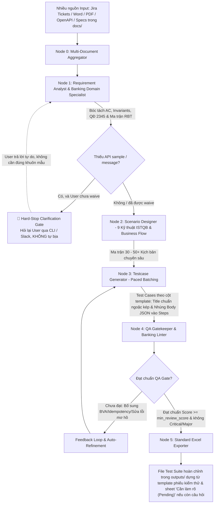

# 🏦 QA Agentic Workflow (Banking & Finance ISTQB & RBT Enabled)

Hệ thống **Multi-Agent AI Workflow** tự động hóa toàn bộ quy trình kiểm thử từ **Phân tích Yêu cầu (Requirements Analysis)**, **Đánh giá Rủi ro (RBT)**, **Thiết kế Ma trận Kịch bản (8 Kỹ thuật ISTQB)** đến **Sinh Test Case Chuẩn Ngân Hàng** xuất ra file Excel theo template phiếu kiểm thử `template/Template Test Execution .xlsx` (metadata, banner phân cấp và công thức thống kê tự động).

---

## 🌟 9 Kỹ Thuật Thiết Kế Kiểm Thử Chuẩn Quốc Tế (ISTQB Multi-Technique & Business Flow)

Hệ thống áp dụng đồng thời **9 kỹ thuật kiểm thử chuyên sâu** (8 kỹ thuật ISTQB kỹ thuật/API + 1 kỹ thuật Business Flow đánh giá tác động nghiệp vụ thực tế) nhằm đạt số lượng từ **30 đến 50+ Test Cases chi tiết** cho mỗi tính năng, đảm bảo độ bao phủ (coverage) toàn diện cả về kỹ thuật lẫn nghiệp vụ:

| # | Kỹ Thuật Kiểm Thử | Trọng Tâm & Quy Chuẩn Áp Dụng | Kịch Bản Tiêu Biểu |
| :- | :--- | :--- | :--- |
| **1** | **Phân vùng Tương đương (EP)** | • Từng giá trị hợp lệ/không hợp lệ của Enum.<br>• Kiểm tra thiếu từng trường bắt buộc (*Field-by-field*).<br>• Sai kiểu dữ liệu (*String vào Boolean/Int/Float, Object vào Array*). | Kiểm tra khai báo Global Params của phí không thành công khi truyền thiếu trường bắt buộc `"tiering_method"` |
| **2** | **Phân tích Giá trị Biên (BVA 2 & 3-Value)** | • Biên hạn mức: `Min-1`, `Min`, `Min+1`, `Max-1`, `Max`, `Max+1`, số âm, số 0.<br>• Biên dải bậc thang (*Bands*): `min > max`, chồng lấn (*overlapping*), hở dải, dải cuối `max != null`. | Kiểm tra chuyển tiền Napas 24/7 thành công khi truyền `"amount"` vừa chạm hạn mức tối đa `"499,999,999"` VND |
| **3** | **Bảng Quyết định (Decision Table - DTT)** | • Ma trận điều kiện kết hợp đa chiều: *Phân loại KH x Loại tài khoản (CASA/Tiết kiệm) x Kênh giao dịch x Khung giờ*. | Kiểm tra tính phí dịch vụ đối với khách hàng VIP giao dịch ngoài giờ trên kênh Mobile |
| **4** | **Kiểm thử Chuyển đổi Trạng thái (STT)** | • Vòng đời thực thể (*Draft -> Active -> Suspended -> Closed*).<br>• Ngăn chặn sửa tham số hoặc giao dịch khi tài khoản đang `LOCKED` / `FROZEN`. | Kiểm tra hệ thống từ chối giao dịch rút tiền khi tài khoản đang ở trạng thái `"LOCKED"` |
| **5** | **Đua tranh & Trùng lặp (Idempotency & Concurrency)** | • Gửi 2 request trùng `idempotency_key` liên tiếp -> Chống trừ tiền 2 lần.<br>• 2 thiết bị rút tiền đồng thời khi số dư chỉ đủ 1 lần (*Race Condition*). | Kiểm tra chống trừ tiền 2 lần khi gửi đồng thời 2 request rút tiền cùng mã `"idempotency_key"` |
| **6** | **Tiêm lỗi & Khả năng Phục hồi (Fault Injection)** | • Giả lập `HTTP 504 Gateway Timeout` từ đối tác -> Chuyển trạng thái `PENDING_RECONCILIATION`.<br>• Rollback toàn bộ giao dịch khi hook phụ bị lỗi giữa chừng. | Kiểm tra xử lý treo và đưa vào đối soát khi nhận mã lỗi `"504 Gateway Timeout"` từ Napas |
| **7** | **Độ chính xác Số học & Pháp chế (Compliance)** | • Quy tắc làm tròn *Banker's Rounding (Round-half-even)*.<br>• Lãi suất năm nhuận (365 vs 366 ngày), bóc tách thuế VAT (8%, 10%).<br>• Bắt buộc xác thực Sinh trắc học theo QĐ 2345/QĐ-NHNN. | Kiểm tra bắt buộc Face matching với chip CCCD khi chuyển tiền vượt hạn mức `"10,000,000"` VND |
| **8** | **Bảo mật & Ký tự Đặc biệt (Security Testing)** | • Xử lý ký tự Unicode / Tiếng Việt có dấu / Emoji trong trường ghi chú.<br>• Ngăn chặn Payload Injection (`<script>`, SQL injection, Schema poisoning).<br>• Phân quyền RBAC (User thường cố gọi API Admin). | Kiểm tra hệ thống sanitize và bắt lỗi khi truyền chuỗi HTML/SQL injection trong trường `"note"` |
| **9** | **Luồng Nghiệp vụ Đầu-cuối & Tác động Đa bên (Business Flow)** | • Trạng thái/kết quả nghiệp vụ thực tế sau hành động (số dư, sổ cái, tồn kho, vòng đời đối tượng) — không chỉ dừng ở response API.<br>• Hệ quả tới các góc nhìn liên quan có căn cứ trong tài liệu (Khách hàng, Dữ liệu/Sổ sách, Tích hợp/Hạ tầng, Pháp chế). | Kiểm tra số dư khả dụng tài khoản nguồn giảm đúng `"500,000"` VND và tài khoản đích tăng đúng số tiền tương ứng sau khi giao dịch chuyển tiền hoàn tất |

---

## 🏗️ Kiến Trúc Multi-Agent Pipeline (LangGraph)


```mermaid
flowchart TD
    A[Nhiều nguồn Input: Jira Tickets / Word / PDF / OpenAPI / Specs trong docs/] --> B[Node 0: Multi-Document Aggregator]
    B --> C[Node 1: Requirement Analyst & Banking Domain Specialist]
    C -->|Bóc tách AC, Invariants, QĐ 2345 & Ma trận RBT| CG{Thiếu API sample / message?}
    CG -- Có, và User chưa waive --> STOP[🛑 Hard-Stop Clarification Gate<br/>Hỏi lại User qua CLI / Slack, KHÔNG tự bịa]
    STOP -.User trả lời tự do, không cần đúng khuôn mẫu.-> C
    CG -- Không / đã được waive --> D[Node 2: Scenario Designer - 9 Kỹ thuật ISTQB & Business Flow]
    D -->|Ma trận 30 - 50+ Kịch bản chuyên sâu| E[Node 3: Testcase Generator - Paced Batching]
    E -->|Test Cases theo cột template: Title chuẩn ngoặc kép & Nhúng Body JSON vào Steps| F[Node 4: QA Gatekeeper & Banking Linter]
    F --> G{Đạt chuẩn QA Gate?}
    G -- Chưa đạt: Bổ sung BVA/Idempotency/Sửa lỗi mơ hồ --> H[Feedback Loop & Auto-Refinement]
    H --> E
    G -- Đạt chuẩn Score >= min_review_score & không Critical/Major --> I[Node 5: Standard Excel Exporter]
    I --> J["File Test Suite hoàn chỉnh trong outputs/ dựng từ template phiếu kiểm thử & sheet 'Cần làm rõ (Pending)' nếu còn câu hỏi"]
```

---

## 📑 Quy Chuẩn Test Case & Template Excel

Mỗi test case sinh ra tuân thủ nghiêm ngặt chuẩn Test Suite Ngân hàng:
1. **Summary / Title Tự Nhiên & Bọc Ngoặc Kép `""`:**
   - *Thành công:* `Kiểm tra update Global Params của phí thành công khi truyền trường "tiering_method" là "flat" và "enabled" là "true"`
   - *Bắt lỗi:* `Kiểm tra deploy Smart Contract của phí không thành công khi truyền thiếu trường bắt buộc "tiering_method"`
   - *Dữ liệu/Query:* `Kiểm tra query Global Params của phí hiển thị đúng trường "condition_type" có giá trị "nested_object"`
2. **Nhúng trực tiếp Body JSON vào cột Steps (Các bước thực hiện):**
   ```text
   1. Gửi request POST /v1/account/withdraw với body:
   {
     "batch_details": {
       "force_posting": "true",
       "processing_channel": "PORTAL",
       "processing_branch_code": "001"
     }
   }
   2. Kiểm tra HTTP status code 200 OK và response body.
   3. Kiểm tra biến động số dư tài khoản.
   ```
3. **Template Excel phiếu kiểm thử (`template/Template Test Execution .xlsx`, cấu hình tại `excel.template_path` trong `configs/config.yaml`):**
   - Giữ nguyên Logo, sheet `DRAW_BUG`; tự điền metadata (Mã tài liệu, Tên ứng dụng, Phiên bản, Mô tả tính năng, Tài liệu). Ngày thực hiện / Người duyệt / Ngày duyệt để trống.
   - 12 cột: Testcase ID (công thức tự đánh số lại khi xóa/chèn dòng), Tên testcase, Các bước thực hiện (kèm Điều kiện tiên quyết ở đầu), Kết quả mong đợi, Dữ liệu test, Trạng thái test, Mức độ ưu tiên, Ghi chú. Các cột Kết quả thực tế, Người tạo, Kế hoạch thực hiện, Ngày thực hiện để trống cho người thực thi.
   - Công thức thống kê (Total/Passed/Failed/Blocked/Not Test/Not Executed), dropdown Trạng thái/Ưu tiên và AutoFilter được co giãn đúng theo vùng dữ liệu mới.
   - Tự động định dạng `Wrap Text`, căn lề `Top-Left` và thụt dòng đẹp mắt cho các khối JSON.

## 🛑 Cơ Chế Hard-Stop Clarification Gate (Không Tự Bịa API Sample / Message)

Hệ thống có một bộ kiểm tra **xác định (deterministic)** — nằm ngoài phán đoán của LLM — chuyên bắt các trường hợp tài liệu đầu vào thiếu dữ kiện quan trọng và **BẮT BUỘC dừng lại hỏi User thay vì tự bịa**:

- **API sample:** nếu tính năng được coi là có liên quan API (mặc định assume API, trừ khi tài liệu rõ ràng thuần UI), hệ thống đòi hỏi phải có **ĐỦ CẢ** sample REQUEST (method, endpoint, request body/payload) **VÀ** RESPONSE (response body, HTTP status) — thiếu 1 trong 2 vẫn bị hỏi lại.
- **Message / mã lỗi:** áp dụng cho mọi loại tính năng (kể cả thuần UI), đòi hỏi phải rõ **ĐỦ CẢ** message cho luồng THÀNH CÔNG **VÀ** luồng THẤT BẠI/LỖI.
- **Trả lời tự do:** User không cần đúng khuôn mẫu "KHÔNG CÓ API" / "KHÔNG CÓ MESSAGE" — chỉ cần diễn đạt theo ý mình (vd: *"tính năng này hiện chưa có API nào cả"*, *"Message: N/A"*), hệ thống tự nhận diện phủ định gần chủ đề để miễn câu hỏi.
- **Fabricated-Message Linter (Node 4):** song song đó, mọi câu message được Test Case assert đều bị đối chiếu ngược lại với tài liệu gốc — message không có căn cứ trong tài liệu bị gắn cờ `Fabricated Message / Ungrounded Value` mức Critical, chặn Quality Gate.
- **Không chặn đứng Excel:** nếu vẫn còn câu hỏi mở khi hết vòng lặp, hệ thống **vẫn xuất file Excel** — các Test Case bị ảnh hưởng được tô vàng, ghi chú `PENDING CLARIFICATION`, và toàn bộ câu hỏi được liệt kê trong sheet riêng **`Cần làm rõ (Pending)`**. Câu hỏi cũng hiển thị ở CLI panel và tin nhắn thread Slack.

👉 **Hội thoại liên tục, không cần chạy lại:** trả lời câu hỏi bằng lời tự do (từng phần hoặc gộp; "không có API", "tùy bạn chọn" đều hợp lệ) ngay trong cùng hội thoại — CLI: gõ tiếp ở dấu nhắc `>`; Slack: nhắn trong thread (không cần tag bot) hoặc DM. Agent (Turn Interpreter, `prompts/06_turn_interpreter.md`) tự phân loại mỗi tin nhắn:
- **Câu trả lời làm rõ** → ghép đúng câu hỏi, gộp vào khối User Clarifications (hiệu lực cao nhất), phân tích lại; còn thiếu thì hỏi tiếp.
- **Tài liệu bổ sung** (file đính kèm / đường dẫn file / mã Jira) hoặc **thay đổi nghiệp vụ** → phân tích lại rồi đồng bộ bộ test case.
- **Feedback lên test case** ("bỏ TC 05", "thêm case OTP hết hạn", "đổi priority TC 03") → Test Case Reviser (`prompts/05_testcase_reviser.md`) chỉ sửa/thêm/xóa đúng TC bị ảnh hưởng, review lại và **xuất đè cùng file/sheet Excel**.
- **"Làm lại toàn bộ"** → chạy lại cả pipeline; **yêu cầu tính năng khác** → mở bộ test case mới.

Tin nhắn gửi khi Agent **đang chạy** được xếp hàng và áp dụng ngay ở bước kế tiếp; thông tin làm thay đổi nghiệp vụ trong lúc sinh lần đầu sẽ khởi động lại pipeline với dữ kiện mới. `-e/--extra` vẫn dùng được để kèm ghi chú ngay từ lệnh đầu.

---

## 🚀 Hướng Dẫn Cài Đặt & Cấu Hình

### 1. Kích hoạt môi trường ảo:
```bash
source .venv/bin/activate
```

### 2. Cấu hình file `.env`:
Tạo file `.env` từ file `.env.example` và điền các thông số cần dùng:

```env
# --- 1. LLM API Keys (Chọn 1 trong các Provider bên dưới) ---
LLM_PROVIDER=google
GEMINI_API_KEY=your_gemini_api_key
GEMINI_MODEL_NAME=gemini-3.6-flash  # Hoặc gemini-3.7-flash / gpt-4o / claude-3-5-sonnet-20241022

# --- 2. Cấu hình Jira API (Để kéo trực tiếp từ Jira Cloud / Server) ---
JIRA_SERVER_URL=https://galaxyfinx.atlassian.net
JIRA_EMAIL=your-email@company.com
JIRA_API_TOKEN=your-atlassian-api-token  # Tạo tại: id.atlassian.com/manage-profile/security/api-tokens

# --- 3. Cấu hình Slack Bot (Nếu chạy bot cho team) ---
SLACK_BOT_TOKEN=xoxb-...
SLACK_APP_TOKEN=xapp-...
SLACK_SIGNING_SECRET=...
```

---

## 🎯 Hướng Dẫn Sử Dụng Local CLI

### 1. Kiểm tra kết nối Jira API:
```bash
python test_jira.py VWCBT-3800
```

### 2. Chạy với Ticket Jira (Tự động kéo User Story về):
```bash
# Bằng mã ticket ngắn gọn:
python run.py VWCBT-3800

# Hoặc bằng link Jira đầy đủ:
python run.py https://galaxyfinx.atlassian.net/browse/VWCBT-3800
```

### 3. Kết hợp nhiều nguồn tài liệu (Multi-Document Specification):
```bash
# Kết hợp 1 Ticket Jira + File Spec trong thư mục docs/:
python run.py VWCBT-3800 "docs/API_Spec_Savings.docx" "docs/Data_Schema.pdf"

# Kết hợp nhiều Ticket Jira liên quan:
python run.py VWCBT-3800 VWCBT-3801 VWCBT-4102

# Kết hợp nhiều file local (.docx, .pdf, .json, .yaml, .md):
python run.py "docs/PRD_Feature.docx" "docs/OpenAPI_Spec.yaml" "docs/Business_Rules.md"

# Kèm ghi chú bổ sung trực tiếp:
python run.py VWCBT-3800 "Lưu ý: Bổ sung thêm kịch bản test đối soát khi có 1000 giao dịch timeout"
```

### 4. Tùy chọn Model AI linh hoạt:
```bash
# Dùng Gemini 3.6 / 3.7 Flash:
python run.py VWCBT-3800 --provider google --model gemini-3.6-flash

# Dùng OpenAI GPT-4o:
python run.py VWCBT-3800 --provider openai --model gpt-4o

# Dùng Claude 3.5 Sonnet:
python run.py VWCBT-3800 --provider anthropic --model claude-3-5-sonnet-20241022

# Dùng DeepSeek V3:
python run.py VWCBT-3800 --provider deepseek --model deepseek-chat

# Dùng Ollama Local (Chạy offline miễn phí):
python run.py VWCBT-3800 --provider ollama --model qwen2.5:14b
```

---

## 💬 Tích Hợp Slack Bot 24/7 Cho Cả Team

Bạn có thể chạy bot để toàn bộ team QA, BA, Dev có thể sử dụng trực tiếp trên Slack:

### 1. Khởi chạy Bot:
```bash
# Chạy trực tiếp từ Terminal:
python slack_run.py

# Hoặc chạy nền Docker Compose (Khuyên dùng cho Server Production) — khởi chạy cả Slack Bot lẫn Web GUI:
docker-compose up -d --build
# Chỉ chạy Slack Bot:
docker-compose up -d --build qa-slack-bot
```

### 2. Cấu hình Slack App (bắt buộc cho hội thoại trong thread/DM):
- **Event Subscriptions → Subscribe to bot events:** `app_mention`, `message.channels`, `message.groups`, `message.im`.
- **OAuth Scopes (Bot Token):** `app_mentions:read`, `chat:write`, `files:read`, `files:write`, `channels:history`, `groups:history`, `im:history`, `commands`.
- Reinstall App vào workspace sau khi thêm scope/event.

### 3. Cách team tương tác trên Slack:
1. **Tag Bot kèm Ticket Jira hoặc nội dung:**  
   `@QAAgent Tạo test suite cho ticket VWCBT-3800`
2. **Kéo thả đính kèm file tài liệu:**  
   Kéo file `.docx`, `.pdf`, `.md` vào ô chat và tag `@QAAgent Hãy viết test case cho file này`
3. **Nhắn tin trực tiếp (Direct Message):**  
   Chat riêng 1-1 với Bot; cả kênh DM là một hội thoại liên tục.
4. **Tiếp tục trong thread (không cần tag lại):** trả lời câu hỏi làm rõ, gửi thêm file/mã Jira, hoặc feedback lên bộ test case bất cứ lúc nào — kể cả khi bot đang chạy. Bot chỉ phản hồi tin nhắn không tag trong thread đã có phiên QA. Với thread `--batch` nhiều ticket, nhắc mã ticket ở đầu tin nhắn.

👉 **Kết quả:** Bot cập nhật tiến trình từng Node thời gian thực, **upload file Excel** ngay trong thread, và upload lại file đã cập nhật (kèm danh sách thay đổi) sau mỗi lượt feedback. Phiên hội thoại lưu trong bộ nhớ tiến trình bot — khởi động lại bot thì bắt đầu phiên mới.

---

## 🌐 Web GUI Cho Người Dùng Không Rành Kỹ Thuật

Giao diện chat trên trình duyệt (tiếng Việt), không cần dòng lệnh hay Slack. Dùng chung engine hội thoại với CLI/Slack: Agent hỏi lại khi thiếu thông tin, User trả lời tự do, gửi thêm tài liệu hoặc feedback bất cứ lúc nào và file Excel được cập nhật ngay.

### 1. Khởi chạy:
```bash
# Chỉ máy của bạn truy cập (mặc định http://localhost:8000):
python web_run.py

# Cho cả team trong mạng nội bộ truy cập (http://<IP-máy-chủ>:8000):
python web_run.py --host 0.0.0.0 --port 8000

# Hoặc Docker Compose (service qa-web-gui, cổng 8000):
docker-compose up -d --build qa-web-gui
```
Biến môi trường tùy chọn: `WEB_HOST`, `WEB_PORT` (hoặc `PORT`), `WEB_HISTORY_DIR` (thư mục lịch sử, mặc định `outputs/web_history/`), `WEB_ACCESS_PASSWORD` (mật khẩu chung cho cả team — xem mục 4). Model AI và Jira dùng cùng cấu hình `.env` như CLI/Slack.

### 2. Cách dùng:
1. **Gửi yêu cầu:** dán User Story, nhập mã Jira (vd `VWCBT-3800`) hoặc bấm 📎 / kéo thả file `.docx`, `.pdf`, `.md`, `.txt`, `.json`, `.yaml` (tối đa 20 MB/file).
2. **Trả lời câu hỏi:** khi Agent hiện thẻ ❓, trả lời bằng lời bình thường — từng phần, gộp nhiều câu, hoặc "không có" / "bạn tự chọn hợp lý".
3. **Tải file & góp ý:** bấm **⬇️ Tải file Excel**; muốn sửa cứ nhắn ("bỏ TC 05", "thêm case OTP hết hạn") — Agent cập nhật cùng file và liệt kê thay đổi. Có thể nhắn ngay cả khi Agent đang chạy.
4. **Cuộc trò chuyện mới:** bắt đầu yêu cầu cho tính năng khác; cuộc trò chuyện cũ vẫn nằm trong thanh lịch sử bên trái.
5. **Tìm lại cuộc trò chuyện cũ:** gõ vào ô *Tìm cuộc trò chuyện…* (không cần dấu: `chuyen tien` khớp "Chuyển tiền"; tìm theo tên tính năng, nội dung đã nhắn, tên file) rồi bấm để mở — xem lại toàn bộ hội thoại, tải lại Excel và tiếp tục góp ý/trả lời như chưa từng rời đi. Chấm màu cho biết trạng thái: xanh lá = đã có kết quả, cam = chờ bạn trả lời, tím nhấp nháy = đang xử lý, đỏ = có lỗi.

⚠️ **Lưu ý bảo mật & vận hành:**
- Mặc định Web GUI **không có đăng nhập**: chỉ mở `--host 0.0.0.0` trong mạng nội bộ tin cậy. Bất kỳ ai truy cập được đều dùng được quota LLM/Jira của server. Đặt `WEB_ACCESS_PASSWORD` để bắt buộc nhập mật khẩu (trình duyệt hiện hộp đăng nhập; tên đăng nhập gõ gì cũng được, chỉ kiểm tra mật khẩu).
- Đường dẫn file gõ trong tin nhắn **không bao giờ** được đọc từ ổ đĩa server (chỉ đọc file User tải lên) — áp dụng cho cả Slack Bot.
- **Lịch sử lưu trên server** (`outputs/web_history/`: `history.db` SQLite + file Excel riêng từng cuộc trò chuyện), không mất khi khởi động lại server — mở lại là tiếp tục được ngay. Cuộc trò chuyện đang chạy dở lúc server tắt cần nhắn lại để Agent chạy tiếp.
- Danh sách lịch sử gắn theo **trình duyệt** (mã lưu ở localStorage), không phải tài khoản: đổi máy/trình duyệt hoặc xóa dữ liệu trình duyệt sẽ không thấy lịch sử cũ (dữ liệu vẫn còn trên server). Đây là phân tách tiện dụng, **không phải bảo mật** — ai có link/mã cuộc trò chuyện vẫn mở được.

### 3. Khắc phục sự cố: đồng nghiệp cùng mạng không vào được
1. **Dùng đúng địa chỉ:** đồng nghiệp phải mở `http://<IP-máy-chủ>:8000` (dòng `👥 Đồng nghiệp cùng mạng nội bộ mở: ...` khi chạy `web_run.py --host 0.0.0.0`), không phải `localhost`.
2. **macOS Firewall chặn Python** (nguyên nhân phổ biến nhất): Python cài qua Homebrew/uv chỉ ký ad-hoc nên không được tự động cho phép; kết nối từ máy khác bị cắt ngay (trình duyệt báo *ERR_EMPTY_RESPONSE* / không tải được). Cho phép đúng ứng dụng mà `web_run.py` in ra ở dòng `Ứng dụng cần cho phép trong Firewall`:
   ```bash
   APP="/opt/homebrew/Cellar/python@3.12/<phiên-bản>/Frameworks/Python.framework/Versions/3.12/Resources/Python.app"
   sudo /usr/libexec/ApplicationFirewall/socketfilterfw --add "$APP"
   sudo /usr/libexec/ApplicationFirewall/socketfilterfw --unblockapp "$APP"
   ```
   Hoặc: System Settings → Network → Firewall → Options → `+` → chọn `Python.app` đó → *Allow incoming connections*. Sau khi `brew upgrade python` (đường dẫn Cellar đổi) phải cho phép lại. Cách thay thế không cần chỉnh Firewall: chạy bằng Docker (`docker-compose up -d --build qa-web-gui`).
3. **Vẫn không được:** mạng Wi-Fi công ty thường bật *client isolation* (các máy không thấy nhau) hoặc đồng nghiệp đang ở VPN/subnet khác — thử ping IP máy chủ; nếu ping không tới, cần IT mở hoặc triển khai Web GUI lên server chung.

### 4. Đưa lên Internet miễn phí bằng Render (thử nghiệm)
Repo có sẵn `render.yaml` (Blueprint): 1 web service Docker, gói **Free**, vùng Singapore, chạy `web_run.py` (tự dùng cổng `PORT` của Render).
1. Commit & push code (gồm `render.yaml`) lên GitHub.
2. Đăng nhập [dashboard.render.com](https://dashboard.render.com) bằng GitHub → **New → Blueprint** → chọn repo này → Render đọc `render.yaml`.
3. Nhập các biến được hỏi (không bao giờ ghi bí mật vào `render.yaml` — repo đang public):
   - `WEB_ACCESS_PASSWORD`: mật khẩu chung cho team, **bắt buộc** (thiếu thì `web_run.py` từ chối khởi động trên Render), nên ≥ 12 ký tự ngẫu nhiên.
   - `GEMINI_API_KEY`, `GEMINI_MODEL_NAME` (vd `gemini-3.5-flash-lite`); `JIRA_SERVER_URL`, `JIRA_EMAIL`, `JIRA_API_TOKEN` nếu cần lấy ticket Jira (bỏ trống nếu không dùng).
4. **Apply** → đợi build xong → mở `https://qa-agent-web.onrender.com` (tên thật Render hiển thị trên dashboard), nhập mật khẩu và gửi link + mật khẩu cho team.

⚠️ **Giới hạn gói Free:**
- Không ai truy cập 15 phút thì service ngủ; lần mở sau chờ ~1 phút để thức dậy.
- Ổ đĩa không lưu lâu dài: **lịch sử hội thoại và file Excel mất** mỗi lần service ngủ, khởi động lại hoặc deploy lại → tải Excel về ngay khi có kết quả. Trang tự mở cuộc trò chuyện mới nếu cuộc cũ đã mất.
- RAM 512 MB, CPU yếu: tạo bộ test case chậm hơn chạy trên máy cá nhân.
- Tài liệu yêu cầu và API key nằm trên server bên ngoài công ty — hỏi bộ phận Bảo mật/Compliance trước khi dùng với tài liệu nghiệp vụ thật.

---

## 📁 Cấu Trúc Dự Án (Repository Structure)

```text
qa-agentic-workflow/
├── prompts/                   # 📝 QUẢN LÝ PROMPTS (PROMPT-AS-CODE - Dễ dàng tùy biến & tinh chỉnh)
│   ├── 01_requirement_analyst.md    # System Prompt: Phân tích yêu cầu & Ma trận RBT
│   ├── 02_scenario_designer.md      # System Prompt: Thiết kế 9 Kỹ thuật ISTQB & Business Flow (30-50+ Scenarios)
│   ├── 03_testcase_generator.md     # System Prompt: Sinh Test Case theo cột template & Nhúng JSON Steps
│   ├── 04_qa_reviewer.md            # System Prompt: QA Gatekeeper & Banking Quality Auditor
│   ├── shared/                      # Rubric dùng chung (severity/priority)
│   └── domains/                     # Domain Pack theo ngành (chọn theo từ khóa nguyên từ, mặc định api-platform)
│       ├── fintech-banking.md       # Lõi ngân hàng tổng quát: bất biến số dư/GL/audit, checklist cut-off, phong tỏa (không chứa giá trị riêng của ngân hàng)
│       └── banking/                 # Module sản phẩm ghép thêm khi yêu cầu nhắc tới: payments, overdraft, lending, cards, deposits
├── docs/                      # Thư mục lưu trữ tài liệu yêu cầu (PRD, Specs, Schemas)
├── outputs/                   # Thư mục chứa các file Test Suite Excel hoàn chỉnh đã xuất
├── samples/                   # File mẫu User Story và tài liệu kiểm thử mẫu
├── configs/
│   └── config.yaml            # Cấu hình Model AI, Temperature và Quy chuẩn QA
├── src/
│   ├── agents/
│   │   ├── requirement_analyst.py   # Node 1: Agent Phân tích nghiệp vụ
│   │   ├── scenario_designer.py     # Node 2: Agent Thiết kế Ma trận Kịch bản
│   │   ├── testcase_generator.py    # Node 3: Agent Sinh Test Case chi tiết
│   │   └── reviewer.py              # Node 4: Agent QA Gatekeeper Reviewer
│   ├── core/
│   │   ├── prompt_loader.py         # Module nạp prompt động từ file .md với LRU Cache
│   │   ├── llm.py                   # Adapter LLM đa Provider (Tự động Retry & Fallback 429)
│   │   ├── models.py                # Pydantic Schemas chuẩn xác thực dữ liệu
│   │   ├── clarification.py         # Deterministic Hard-Stop Clarification Gate (API req/res, message ok/error)
│   │   ├── linter.py                # Deterministic QA & Banking Domain Linter (kèm Fabricated-Message check)
│   │   ├── state.py                 # LangGraph Workflow State
│   │   └── workflow.py              # LangGraph Orchestration Pipeline
│   ├── integrations/
│   │   ├── jira_connector.py        # Module kết nối Jira API (Cloud & Server/Data Center)
│   │   ├── slack_bot.py             # Slack Socket Mode Bot với real-time progress update
│   │   ├── web_app.py               # Web GUI (FastAPI): API hội thoại, upload, tải Excel
│   │   ├── web_history.py           # Lịch sử hội thoại Web GUI (SQLite): tìm kiếm & khôi phục sau khi restart
│   │   └── web/index.html           # Giao diện chat tiếng Việt cho người dùng không rành kỹ thuật
│   └── utils/
│       ├── file_parsers.py          # Trích xuất Word, PDF, Markdown, OpenAPI & Multi-doc Aggregator
│       └── excel_exporter.py        # Xuất Excel theo template phiếu kiểm thử & Pretty JSON Formatter
├── template/
│   └── Template Test Execution .xlsx  # Template Excel phiếu kiểm thử mặc định
├── tests/
│   └── test_components.py          # Bộ kiểm thử tích hợp tự động cho toàn bộ hệ thống
├── run.py                     # CLI Entrypoint chính chạy Local
├── test_jira.py               # Công cụ chẩn đoán kết nối Jira API
├── slack_run.py               # Slack Bot Runner
├── web_run.py                 # Web GUI Runner (python web_run.py → http://localhost:8000)
├── Dockerfile                 # Docker containerization
├── docker-compose.yml         # Triển khai Docker Compose 24/7
├── render.yaml                # Render Blueprint: Web GUI trên gói Free
└── README.md                  # Hướng dẫn chi tiết dự án
```

---

## ✍️ Tùy Chỉnh Prompts Dễ Dàng (Prompt-as-Code)

Toàn bộ System Prompt của các Agent đã được tách biệt hoàn toàn thành các file Markdown trong thư mục `prompts/`:
- **`prompts/01_requirement_analyst.md`**: Tinh chỉnh các quy tắc bóc tách nghiệp vụ, phát hiện giả định (Assumptions) và chấm điểm ma trận rủi ro RBT.
- **`prompts/02_scenario_designer.md`**: Bổ sung hoặc tùy biến các kỹ thuật kiểm thử ISTQB (EP, BVA, Decision Table, Concurrency, State Transition...).
- **`prompts/03_testcase_generator.md`**: Thay đổi văn phong đặt tên tiêu đề kịch bản, cách trình bày bước thực hiện và dữ liệu payload.
- **`prompts/04_qa_reviewer.md`**: Tùy chỉnh các tiêu chí chấm điểm và rào chắn chất lượng (Quality Gate).
- **`prompts/05_testcase_reviser.md`**: Quy tắc cập nhật tăng dần bộ test case theo feedback/thay đổi trong hội thoại.
- **`prompts/06_turn_interpreter.md`**: Quy tắc phân loại tin nhắn của User trong hội thoại (câu trả lời / cập nhật yêu cầu / feedback / làm lại / yêu cầu mới).
- **`prompts/domains/`**: Domain Pack theo ngành. Pack ngân hàng ở mức **tổng quát**: chỉ liệt kê bất biến, nhóm biên, máy trạng thái và "Tham số cần lấy từ BRD" — không chứa giá trị riêng của ngân hàng nào (giờ cut-off, hạn mức, ngưỡng, thứ tự thu nợ, mức pháp chế). Mọi giá trị lấy từ BRD/tài liệu hoặc câu trả lời làm rõ; thiếu thì thành câu hỏi làm rõ. Với ngân hàng, pipeline luôn nạp lõi `fintech-banking.md` và ghép thêm các module `banking/<module>.md` mà tên tính năng/AC có nhắc tới (`resolve_banking_modules` trong `src/core/prompt_loader.py`). Linter ngân hàng (`BANKING_RULES` trong `src/core/linter.py`) cũng chỉ bật rule khi yêu cầu nhắc chủ đề tương ứng. Sau khi sửa pack, chép lại sang `.agents/skills/banking-qa-testsuite-generator/references/05-banking-domain-pack/` (`core.md` = `fintech-banking.md`) — test sẽ báo lỗi nếu hai bản lệch nhau.

💡 **Ưu điểm:** Bạn hoặc các thành viên trong team QA/BA có thể mở trực tiếp các file `.md` này để chỉnh sửa văn phong, bổ sung nghiệp vụ đặc thù mà **không cần chạm vào bất kỳ dòng code Python nào**!

---

## 🧪 Chạy Kiểm Thử Tích Hợp Hệ Thống

Để đảm bảo toàn bộ hệ thống hoạt động ổn định và sẵn sàng:
```bash
python tests/test_components.py
```
*(Kiểm tra toàn diện 25 bộ test, gồm: File Parsers, QA Domain Linter, Excel Exporter Template, LangGraph Workflow Compilation, Agent LLM Invocation Contracts, Multi-Domain Support, Hard-Stop Clarification Gate, Slack Thread Session Memory, Slack Quality Gate Failure Visibility, Raw-Content Grounding, LLM Request Timeout, Batch CLI/Slack, Conversational Follow-up (cập nhật tăng dần, tin nhắn giữa chừng), Revision Merge, File Sandbox cho kênh từ xa, Web GUI API, Web GUI History, Web GUI Access Password)*.
