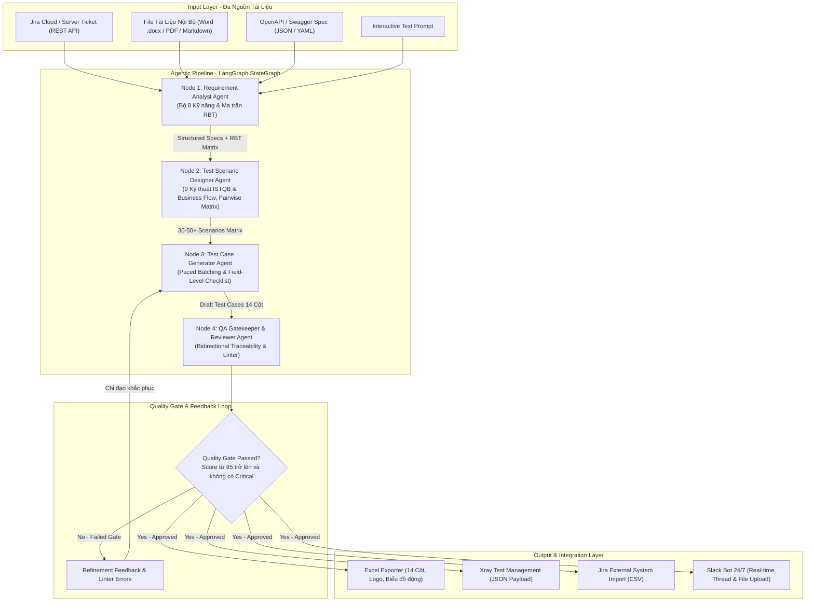
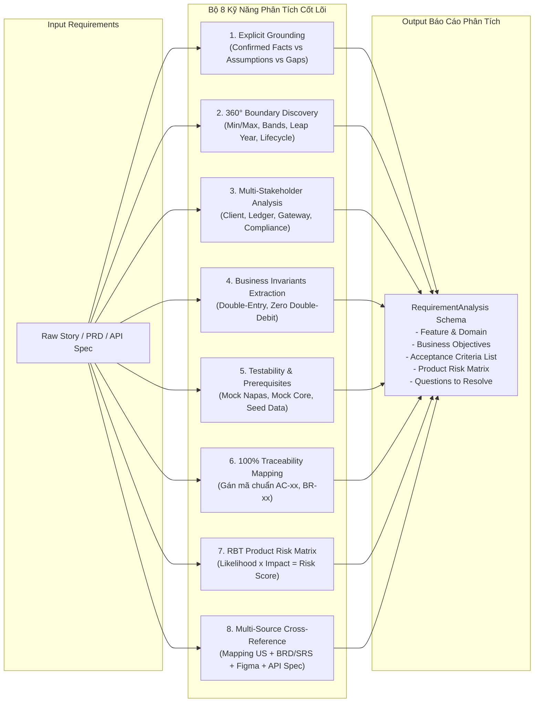
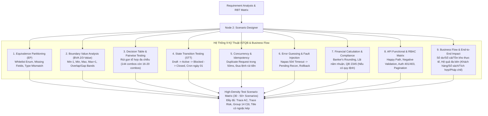
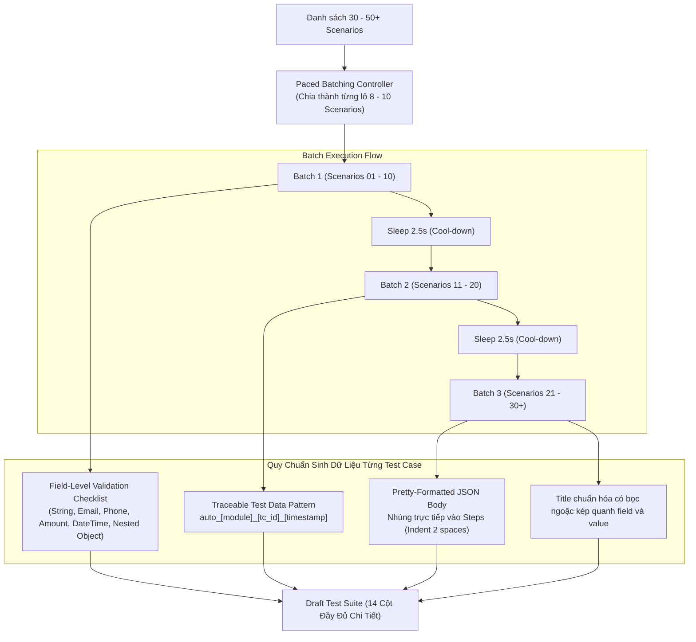
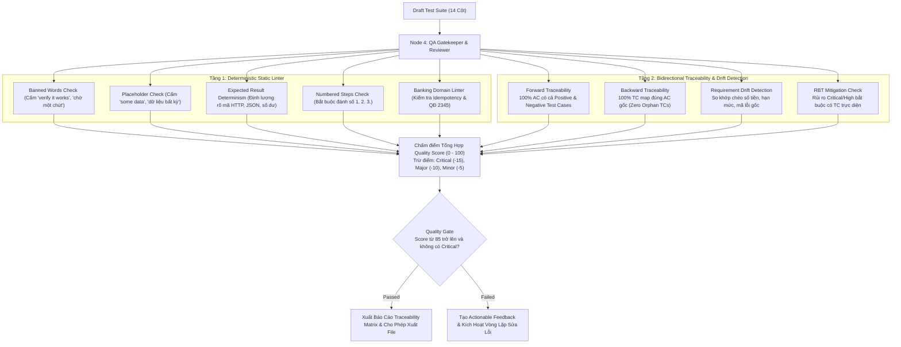
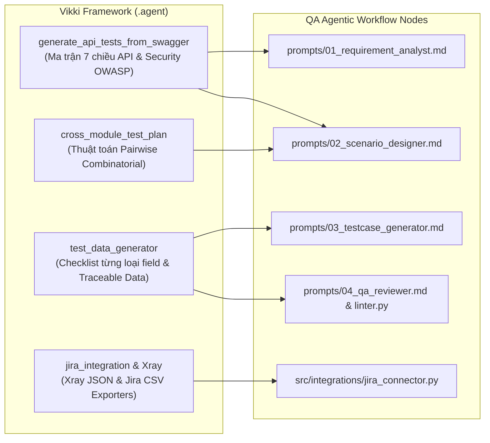
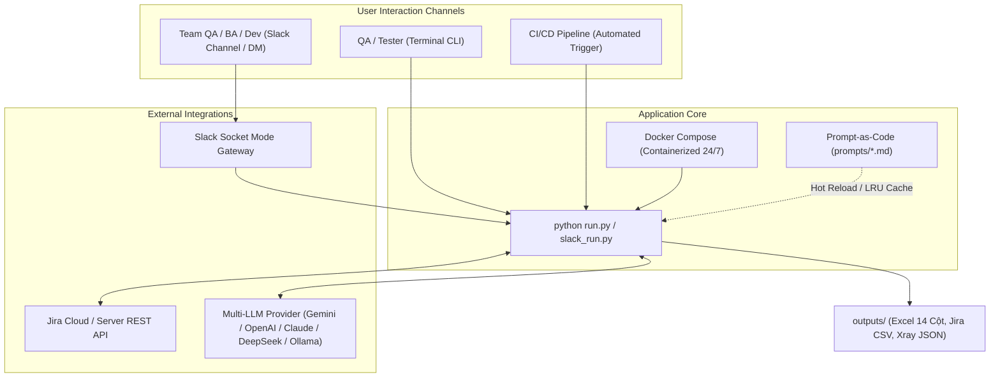

# 🏦 QA Agentic Workflow — Toàn Bộ Sơ Đồ Kiến Trúc & Luồng Xử Lý (System Architecture Charts)

Tài liệu này tổng hợp toàn bộ các sơ đồ kiến trúc (Mermaid Diagrams), luồng tương tác đa Agent, cơ chế kiểm soát chất lượng (Quality Gate) và ma trận truy vết (Traceability) của hệ thống **QA Agentic Workflow**.

---

## 1. Kiến Trúc Tổng Quan Hệ Thống (End-to-End Multi-Agent Architecture)

Hệ thống hoạt động theo mô hình **LangGraph Multi-Agent Pipeline có Feedback Loop & Self-Correction Quality Gate**:

---

## 2. Node 1: Bộ 8 Kỹ Năng Phân Tích Yêu Cầu (Requirement Analysis Framework)

Cơ chế bóc tách yêu cầu chuyên sâu, chống suy diễn (Anti-Hallucination) và bao phủ 100% nghiệp vụ:

---

## 3. Node 2: Thiết Kế Ma Trận Kịch Bản Đa Kỹ Thuật (9 ISTQB & Business-Flow Techniques + Pairwise Matrix)

Đảm bảo độ dày kịch bản kiểm thử đạt **30 đến 50+ Test Cases** cho mỗi tính năng:

---

## 4. Node 3: Cơ Chế Sinh Test Case (Paced Batching & Field-Level Checklist)

Quy trình sinh Test Case 14 cột với cơ chế chia lô chống lỗi Rate Limit (429) và nhúng trực tiếp Body JSON:

---

## 5. Node 4: Cơ Chế Truy Vết 2 Chiều & Quality Gate (Bidirectional Traceability)

Hàng rào bảo vệ chất lượng kết hợp giữa Linter toán học và Semantic Review:

---

## 6. Sơ Đồ Tích Hợp Kỹ Năng Từ Vikki Framework (.agent)

Bản đồ kế thừa các kỹ năng tuyển chọn từ `/Users/hai.vu/Documents/Finx/vikki-auto-framework/.agent`:

---

## 7. Kiến Trúc Triển Khai & Vận Hành (Deployment Architecture)

Mô hình hỗ trợ đa phương thức tương tác: CLI Local, Slack Bot 24/7 và Docker Container:

